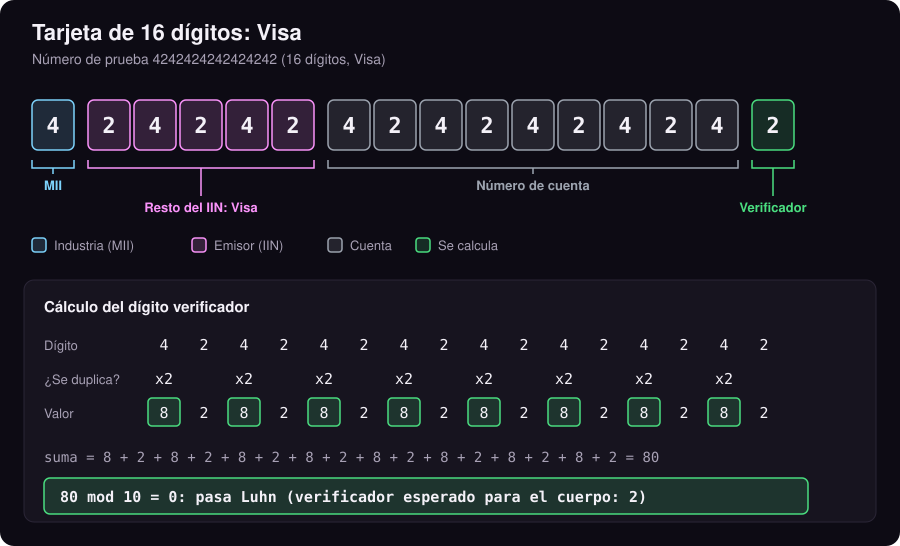
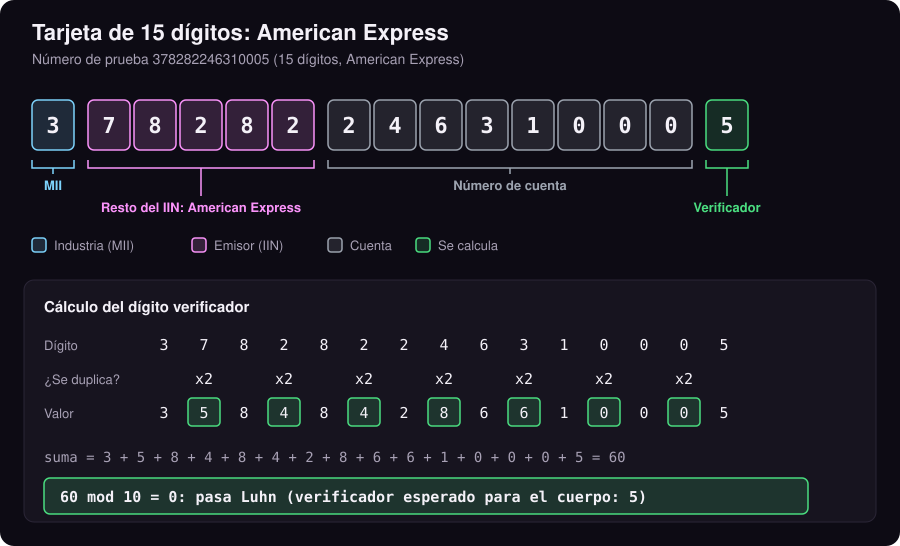
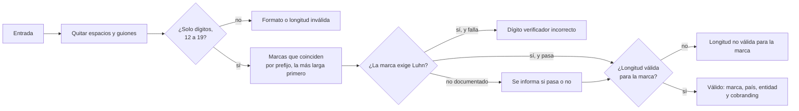

# Verificador de Tarjeta

Validación algorítmica de números de tarjeta de pago: dígito verificador (Luhn), marca por prefijo (IIN) y longitud permitida para esa marca. Todo se calcula localmente, sin consultar ninguna red de pago, banco ni base de datos.

Demo en vivo (con las 8 redes internacionales): https://mino-mateo.github.io/#tools

## Contenido

- [Anatomía de un número de tarjeta](#anatomía-de-un-número-de-tarjeta)
- [Qué hace y qué no hace](#qué-hace-y-qué-no-hace)
- [Cómo funciona](#cómo-funciona): limpieza, Luhn, marca por prefijo y resultado
- [API](#api), [Números de prueba](#números-de-prueba), [Cómo correrlo](#cómo-correrlo)

## Anatomía de un número de tarjeta

Un número de tarjeta (PAN) sigue la norma **ISO/IEC 7812** y tiene entre 12 y 19 dígitos en tres partes:

| Color | Parte | Qué es |
|---|---|---|
| Celeste | **MII** (primer dígito) | Industria del emisor: `4` y `5` banca, `3` viajes y entretenimiento, `6` comercio y banca |
| Rosa | **IIN / BIN** (primeros 6 u 8 dígitos, incluye el MII) | Identifica la red y el banco emisor. Desde la revisión de 2017 de la norma el IIN pasa a 8 dígitos |
| Gris | **Número de cuenta** | Lo asigna el banco; con IIN de 8 dígitos tiene como máximo 10 |
| Verde | **Dígito verificador** | Se calcula con el algoritmo de Luhn; no se asigna |

<p align="center"></p>

<details>
<summary><strong>Tabla completa del MII (primer dígito)</strong></summary>

| Dígito | Industria |
|---|---|
| 0 | ISO/TC 68 y otras asignaciones |
| 1 | Aerolíneas |
| 2 | Aerolíneas, finanzas y asignaciones futuras |
| 3 | Viajes y entretenimiento |
| 4 | Banca y finanzas |
| 5 | Banca y finanzas |
| 6 | Comercio y banca |
| 7 | Petroleras y asignaciones futuras |
| 8 | Salud, telecomunicaciones y asignaciones futuras |
| 9 | Asignación de los organismos nacionales de normalización |

Fuente: [ISO/IEC 7812, Wikipedia](https://en.wikipedia.org/wiki/ISO/IEC_7812).

</details>

> [!NOTE]
> Por eso UATP (tarjetas de aerolíneas) empieza por `1`, American Express y Diners por `3`, Visa por `4` y Mastercard por `5` o `2`.

## Qué hace y qué no hace

Hace:

- Comprueba que el número cumple el algoritmo de Luhn y, si no, indica qué dígito verificador se esperaba.
- Identifica la red por su prefijo entre 29 marcas de 17 países: las internacionales (Visa, Mastercard, American Express, Discover, Diners Club, JCB, UnionPay, Maestro) y redes nacionales como Elo e Hipercard (Brasil), Naranja (Argentina), Mir (Rusia), RuPay (India) o Troy (Turquía), además de redes ya retiradas.
- Informa país de origen y entidad operadora de cada red.
- Detecta cobranding: si el prefijo también pertenece a otra red (por ejemplo, Elo dentro del rango de Visa), lo indica.
- Comprueba que la longitud es válida para esa marca.
- Devuelve el cálculo de Luhn paso a paso, para mostrarlo o auditarlo.

No hace:

- No confirma que la tarjeta exista, esté activa, tenga fondos o pertenezca a alguien.
- No consulta la fecha de vencimiento ni el CVV, y no los pide.
- No identifica el banco emisor: eso requiere una base de datos de BIN de 6 a 8 dígitos que cambia a diario y no es pública. Aquí se identifica la **red**, no la entidad financiera que emitió la tarjeta.
- No guarda ni envía nada: no hay red, almacenamiento ni analítica.

Un número "válido" aquí solo significa que es **estructuralmente consistente**. Es la misma comprobación que hace un formulario de pago antes de enviar los datos, útil para detectar errores de tipeo y para clasificar números en investigaciones.

## Uso responsable

Usa números de prueba públicos (tabla de abajo). No escribas tarjetas reales en herramientas que no controlas: aunque esta no envía nada, es un buen hábito. Validar el formato no da acceso a nada: sin emisor, vencimiento, CVV y autorización del banco, un número es solo una secuencia de dígitos.

## Cómo funciona

### 1. Limpieza

Se quitan espacios y guiones. Si queda algo que no sea un dígito, el número se rechaza. Una tarjeta tiene entre 12 y 19 dígitos (ISO/IEC 7812).

### 2. Algoritmo de Luhn (módulo 10)

Recorriendo el número de derecha a izquierda, sin contar el último dígito (el verificador), se duplica un dígito sí y otro no. Si el doble pasa de 9, se le resta 9. Luego se suman todos los valores, incluido el verificador. El número es válido si la suma es múltiplo de 10.

Ejemplo con `4242 4242 4242 4242`:

| Dígito | 4 | 2 | 4 | 2 | 4 | 2 | 4 | 2 | 4 | 2 | 4 | 2 | 4 | 2 | 4 | 2 |
|---|---|---|---|---|---|---|---|---|---|---|---|---|---|---|---|---|
| ¿Se duplica? | sí | no | sí | no | sí | no | sí | no | sí | no | sí | no | sí | no | sí | no |
| Valor | 8 | 2 | 8 | 2 | 8 | 2 | 8 | 2 | 8 | 2 | 8 | 2 | 8 | 2 | 8 | 2 |

Suma = 80, y 80 % 10 = 0: pasa Luhn.

Con un número de largo **impar** (Amex tiene 15) el duplicado empieza en el segundo dígito, porque siempre se cuenta desde la derecha:

<p align="center"></p>

El dígito verificador esperado para un cuerpo dado se obtiene agregando un 0 al final y calculando `(10 - suma % 10) % 10`. Luhn detecta cualquier error en un solo dígito y casi todas las transposiciones de dos dígitos adyacentes. Es el mismo principio que usa la cédula ecuatoriana (ver [Verificador de Cédula](https://github.com/Mino-Mateo/Verificador-de-C-dula)).

### 3. Marca por prefijo (IIN)

Los primeros dígitos identifican la red. Muchos rangos se superponen, así que se aplican dos reglas:

- **Gana el prefijo más largo.** `622126` a `622925` es Discover (cobranding con UnionPay) y el resto de `62` es UnionPay; `401178` es Elo aunque empiece por `4` como Visa.
- **Ante un empate de largo, gana la red que aparece antes en el catálogo.** `65` es Discover, y el resultado avisa que RuPay y Troy usan el mismo prefijo.

Todas las demás coincidencias se devuelven en `otras`, porque en una investigación importa saber que un número puede pertenecer a más de una red.

Algunas redes no documentan públicamente si usan Luhn (Napas, WEX). En esos casos el número no se rechaza por Luhn, pero el resultado dice si pasa o no. Las redes retiradas se reconocen porque siguen apareciendo en registros antiguos y en bases filtradas.

#### Redes internacionales

| Marca | País | Entidad | Prefijos | Longitudes | Luhn |
|---|---|---|---|---|---|
| Visa | Estados Unidos | Visa Inc. | 4 | 13, 16, 19 | sí |
| Mastercard | Estados Unidos | Mastercard Inc. | 51-55, 2221-2720 | 16 | sí |
| American Express | Estados Unidos | American Express Company | 34, 37 | 15 | sí |
| Discover | Estados Unidos | Discover Global Network | 6011, 644-649, 65, 622126-622925 | 16-19 | sí |
| Diners Club | Estados Unidos | Diners Club International | 30, 36, 38, 39 | 14-19 | sí |
| JCB | Japón | JCB Co., Ltd. | 3528-3589 | 16-19 | sí |
| UnionPay | China | China UnionPay | 62 | 16-19 | sí |
| Maestro | Internacional | Mastercard Inc. | 5018, 5020, 5038, 5893, 6304, 6759, 6761-6763 | 12-19 | sí |
| Maestro UK | Reino Unido | Mastercard Inc. | 676770, 676774 | 12-19 | sí |
| UATP | Internacional (aerolíneas) | Universal Air Travel Plan | 1 | 15 | sí |

#### América Latina

| Marca | País | Entidad | Prefijos | Longitudes | Luhn |
|---|---|---|---|---|---|
| Elo | Brasil | Elo Serviços S.A. | 401178, 401179, 438935, 457631, 457632, 431274, ... (27 rangos, ver src/tarjeta.ts) | 16 | sí |
| Hipercard | Brasil | Itaú Unibanco | 606282 | 16 | sí |
| Hiper | Brasil | Itaú Unibanco | 637095, 63737423, 63743358, 637568, 637599, 637609, 637612 | 16 | sí |
| Naranja | Argentina | Naranja X (Grupo Galicia) | 589562, 402918, 527572 | 16 | sí |

#### Europa y Asia central

| Marca | País | Entidad | Prefijos | Longitudes | Luhn |
|---|---|---|---|---|---|
| Mir | Rusia | NSPK (Sistema Nacional de Tarjetas de Pago) | 2200-2204, 2205 | 16-19 | sí |
| Troy | Turquía | BKM (Bankalararası Kart Merkezi) | 65, 9792 | 16 | sí |
| Dankort | Dinamarca | Nets (Nexi) | 5019, 4571 | 16 | sí |
| UkrCart | Ucrania | UkrCart | 60400100-60420099 | 16-19 | sí |
| Uzcard | Uzbekistán | Uzcard | 8600, 5614 | 16 | sí |
| HUMO | Uzbekistán | HUMO (Banco Central de Uzbekistán) | 9860 | 16 | sí |

#### Asia y África

| Marca | País | Entidad | Prefijos | Longitudes | Luhn |
|---|---|---|---|---|---|
| RuPay | India | NPCI (National Payments Corporation of India) | 60, 65, 81, 82, 508, 353, 356 | 16 | sí |
| China T-Union | China | China T-Union (tarjetas de transporte) | 31 | 19 | sí |
| LankaPay | Sri Lanka | LankaClear | 357111 | 16 | sí |
| GPN | Indonesia | Gerbang Pembayaran Nasional (Bank Indonesia) | 1946 | 16, 18, 19 | sí |
| Napas | Vietnam | NAPAS | 9704 | 16, 19 | sin documentar |
| Verve | Nigeria | Interswitch | 506099-506198, 650002-650027, 507865-507964 | 16, 18, 19 | sí |

#### Tarjetas de flota

| Marca | País | Entidad | Prefijos | Longitudes | Luhn |
|---|---|---|---|---|---|
| WEX | Estados Unidos | WEX Inc. (tarjetas de flota) | 960046 | 19 | sin documentar |

#### Redes retiradas (siguen en registros antiguos y filtraciones)

| Marca | País | Entidad | Prefijos | Longitudes | Luhn |
|---|---|---|---|---|---|
| Bankcard | Australia | Bancos australianos (retirada en 2006) | 5610, 560221-560225 | 16 | sí |
| Solo | Reino Unido | Solo (retirada en 2011) | 6334, 6767 | 16, 18, 19 | sí |

Ecuador no tiene una red nacional propia: las tarjetas locales se emiten sobre Visa, Mastercard, American Express y Diners Club (Diners Club del Ecuador es emisor, no una red distinta).

Fuentes, revisadas el 2026-09-29: [Payment card number, Wikipedia](https://en.wikipedia.org/wiki/Payment_card_number) para la tabla IIN y [credit-card-type de Braintree](https://github.com/braintree/credit-card-type) (MIT) para Elo, Hipercard, Hiper y Naranja. Los rangos cambian con el tiempo; la serie 2 de Mastercard, por ejemplo, está activa desde 2017.

### Flujo completo



> [!WARNING]
> Luhn solo detecta errores de tipeo. Cualquiera puede generar números que lo cumplan: por eso un comercio nunca debe tratar "pasa Luhn" como "tarjeta real". La autorización del banco es lo único que confirma una tarjeta.

### 4. Resultado

| Caso | Mensaje |
|---|---|
| Todo correcto | `Número válido: Visa (Estados Unidos, Visa Inc.)` |
| Cobranding o prefijo compartido | `Número válido: Elo (Brasil, Elo Serviços S.A.; el prefijo también coincide con Visa)` |
| Red retirada | `Número válido: Solo (Reino Unido, Solo (retirada en 2011); red retirada)` |
| Red sin Luhn documentado | `Número válido: Napas (Vietnam, NAPAS; Luhn no documentado para esta red (no pasa))` |
| Falla Luhn | `Dígito verificador incorrecto (esperado 2, recibido 1)` |
| Pasa Luhn sin marca conocida | `Pasa Luhn, pero el prefijo no corresponde a ninguna marca soportada` |
| Longitud distinta a la de la marca | `Longitud no válida para American Express: 16 dígitos (esperado 15)` |
| Caracteres no numéricos o fuera de 12-19 | `Formato inválido: ...` / `Longitud inválida: ...` |

## API

```ts
import { validarTarjeta, detectarMarca, marcasCoincidentes, pasosLuhn, digitoVerificador, MARCAS } from "./src/tarjeta.ts";

const r = validarTarjeta("4242 4242 4242 4242");
// r.valido   -> true
// r.mensaje  -> "Número válido: Visa (Estados Unidos, Visa Inc.)"
// r.marca    -> { id: "visa", nombre: "Visa", pais: "Estados Unidos", entidad: "Visa Inc.",
//                 prefijos: ["4"], longitudes: [13, 16, 19], luhn: true, activa: true }
// r.otras    -> []  (otras redes que comparten el prefijo)
// r.pasos    -> [{ digito: 4, duplicado: true, valor: 8 }, ...]
// r.suma     -> 80

digitoVerificador("424242424242424"); // -> 2
marcasCoincidentes("4571000000000000").map((m) => m.nombre); // -> ["Dankort", "Visa"]
MARCAS.length; // -> 29
```

Sin dependencias en tiempo de ejecución. TypeScript solo para compilar.

## Números de prueba

Números públicos de la [documentación de pruebas de Stripe](https://docs.stripe.com/testing). No corresponden a tarjetas reales.

| Marca | Número |
|---|---|
| Visa | 4242 4242 4242 4242 |
| Mastercard | 5555 5555 5555 4444 |
| Mastercard (serie 2) | 2223 0031 2200 3222 |
| American Express | 3782 822463 10005 |
| Discover | 6011 1111 1111 1117 |
| Diners Club (14 dígitos) | 3622 720627 1667 |
| JCB | 3566 0020 2036 0505 |
| UnionPay (19 dígitos) | 6205 5000 0000 0000 004 |

## Cómo correrlo

Requiere Node.js 22.18 o superior (ejecuta TypeScript de forma nativa en los tests).

```bash
npm install
npm test          # 48 tests con node:test
npm run build     # compila src/ a dist/
npm run demo      # compila y sirve index.html en http://localhost:8000
```

## Estructura

```
src/tarjeta.ts          validador: Luhn y catálogo de redes (país, entidad, prefijos, longitudes)
docs/generar-diagramas.py  dibuja los SVG de este README y recalcula Luhn
test/tarjeta.test.ts    tests con números de prueba y casos límite
index.html              demo mínima que usa dist/tarjeta.js
```

## Autor

Mateo Miño, Investigador OSINT y Tech Lead en [eCondor Digital](https://econdordigital.org/). Portafolio: https://mino-mateo.github.io
